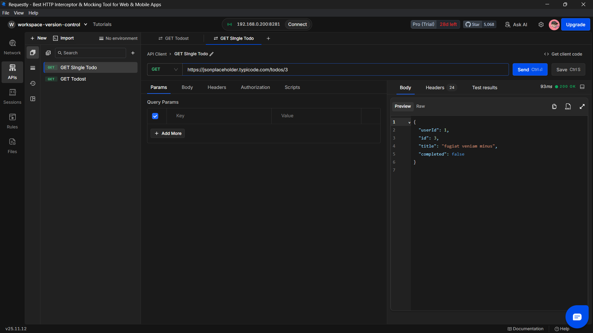

## 🚀 Introduction

**Requestly's Local Workspace** lets you manage API collections, mock files, and rules right from your computer. When you connect it with **Git**, you get all the benefits of version control:

- ✅ **Track changes** to your APIs, mocks, and rules over time
- ✅ **Collaborate seamlessly** with your team using industry-standard Git workflows
- ✅ **Sync updates** effortlessly across team members
- ✅ **Roll back** to previous versions when needed

This comprehensive guide walks you through setting up Git with Requestly's Local Workspace, from initialization to team collaboration, with practical examples and visual walkthroughs.

---

## 📋 Prerequisites

Before you begin, make sure you have the following set up:

- **Requestly Desktop App** - Install and set up the [Requestly Desktop App](https://requestly.com/downloads) on your system to create and manage Local Workspaces.

- **Git** - Ensure [Git](https://git-scm.com/downloads) is installed and configured on your machine.

  Verify your installation:

  ```bash
  git --version
  ```

- **GitHub Account** - Create or use an existing [GitHub account](https://github.com) to host your workspace repository and enable collaboration with your team.

---

## 📖 Step-by-Step Guide

### **Step 1: Create a Local Workspace**

Start by creating a new Local Workspace in Requestly:

**a)** Open the **Requestly Desktop App**  
**b)** Click on **"Create Workspace"**  
**c)** Select **"Local Workspace"**  
**d)** Choose a folder on your system where your workspace files will be stored

> **💡 Tip:** Choose a dedicated folder for your workspace to keep your project organized and easy to manage with Git.


---

### **Step 2: Add APIs, Rules, or Collections**

Now that your workspace is set up, let's populate it with some content:

**a)** Navigate to your newly created workspace  
**b)** Create API collections, mock responses, or rules as needed  
**c)** Save your changes within the Requestly interface


> **📝 Note:** All changes you make are automatically saved to your local workspace folder, making them ready for version control.

---

### **Step 3: Initialize a Git Repository and Share with Your Team** (User A)

As the workspace creator (User A), you'll now set up version control and share your workspace with teammates. This allows User B and other team members to collaborate on the same workspace.

Let's connect your workspace to Git and push it to GitHub:

**a) Create a New Repository on GitHub**

- Go to [GitHub](https://github.com/new) and create a new repository
- **Important:** Do not initialize it with a README, `.gitignore`, or license file
- Copy the repository URL (you'll need it in step f)

**b) Navigate to Your Workspace Folder**

Open your terminal (Command Prompt, PowerShell, or Terminal) and navigate to your workspace:

```bash
cd path/to/your-workspace
```

**c) Initialize Git**

Initialize a new Git repository in your workspace folder:

```bash
git init
```

**d) Stage and Commit Your Files**

Add all workspace files to Git and create your first commit:

```bash
git add .
git commit -m "Initial commit: Add Requestly workspace"
```

**e) Set the Default Branch**

Rename your branch to `main` (GitHub's default):

```bash
git branch -M main
```

**f) Connect to GitHub**

Link your local repository to the GitHub remote:

```bash
git remote add origin https://github.com/your-username/your-repository-name.git
```

> **⚠️ Warning:** Replace `your-username` and `your-repository-name` with your actual GitHub username and repository name.

**g) Push Your Code**

Upload your workspace to GitHub:

```bash
git push -u origin main
```

🎉 Your workspace is now version-controlled and hosted on GitHub, ready for team collaboration!

---

### **Step 4: Clone and Import the Workspace** (User B)

Now that User A has pushed the workspace to GitHub, any team member (like User B) can access it. User A should share the repository URL with the team.

As User B (or any other team member), follow these steps to get the shared workspace on your local machine:

**a) Clone the Repository**

Open terminal and navigate to where you want to store the workspace:

```bash
cd path/to/your-projects
git clone https://github.com/username/repository-name.git
```

**b) Import into Requestly**

- Open Requestly Desktop App
- Click **"Create Workspace"** → **"Local Workspace"**
- **Important:** Select the **parent folder** containing your cloned repository, not the cloned folder itself
- Give the workspace the **same name** as the cloned repository folder


> **⚠️ Common Mistake:** Make sure to select the parent directory containing the cloned workspace, not the workspace folder itself. The workspace name should match the cloned folder name exactly.

You should now see all the APIs and collections created by your team member! ✅

---

### **Step 5: Making Changes and Pushing Updates** (User B)

Now that User B has the workspace set up locally, let's see how they can make changes and share them with the team.

**a) Make Your Changes**

- Open the workspace in Requestly
- Modify existing APIs or create new ones
- Save your changes in the Requestly interface


**b) Commit and Push Changes**

Navigate to your workspace folder and push your updates:

```bash
cd path/to/your-workspace
git add .
git commit -m "Update API endpoints and add new mock responses"
git push origin main
```

> **💡 Tip:** Write descriptive commit messages that clearly explain what changed. This helps your team understand the updates at a glance.

---

### **Step 6: Pulling Changes and Staying in Sync** (User A)

When User B pushes changes to GitHub, User A (and any other team members) need to pull those updates to stay in sync with the latest version.

Here's how User A pulls the changes User B just made:

**a) Pull the Latest Updates**

```bash
cd path/to/your-workspace
git pull origin main
```

**b) Refresh Your Workspace**

After pulling, refresh your Requestly workspace to see the updated APIs and collections made by User B.



> **📝 Note:** If you have unsaved changes in Requestly, make sure to save them before pulling to avoid conflicts.

> **🔄 Remember:** This workflow works both ways! User A can also make changes and push them, and User B would pull those updates. This is how Git enables seamless team collaboration.

---

## Troubleshooting

### Workspace Not Showing Updated Files

Try refreshing the Requestly Desktop App or reimporting the workspace after pulling changes.

## Conclusion

By integrating Git with Requestly's Local Workspace, you've unlocked a powerful workflow for version control and collaboration. You can now:

- ✅ Track changes to your APIs, mocks, and rules over time
- ✅ Collaborate seamlessly with your team using Git workflows
- ✅ Roll back to previous versions if something breaks
- ✅ Work offline and sync changes when ready

This setup transforms your Requestly workspace into a fully version-controlled project, giving you the same collaboration benefits you enjoy with your codebase.

## Additional Resources


- [Version Control for Your APIs using Git](https://medium.com/@dmelloaries/version-control-for-your-apis-using-git-with-requestlys-local-workspace-4369cd766e93)

